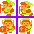

<style>
	.pageBreak {
		margin-top: 350px;
	}
</style>


# JS Game Engine

A hobby project, which started to grow and now needs a documentation, so it's easier to pick it up after some time of leaving it behind.

# Sections
- [Basics](#Basics)
- [Structs](#Structs)
  - [Vector2](##Vector2)
  - [Rect](##Rect)
  - [Sprite Label](##Sprite-Label)
- [Inputs](#Input)
- [Sprites](#Sprites)
- [GameObjects](#GameObjects)

# Basics
This engine uses [GameObjects](#GameObjects) to run the game, somewhat similary to Unity.

To get you started follow this walking simulator:

Create a script called `player.js` in the js folder:
```javascript
import GameObject from './engine/GameObject';
import {sprites} from './engine/sprites';
import * as Input from './engine/input';

export default class Player extends GameObject {
	constructor() {
		super();
		this.position = {x: 20, y: 20}
		this.sprite = sprites.player;
	}

	update(tick) {
		this.position.x += Input.Axes.Horizontal.value;
		this.position.y += Input.Axes.Vertical.value;
	}
}
```

Edit the Main function in `main.js` (found in /js/engine/):
```javascript
function Main() {
	GameObject.init(new Player());
}
```

Add a player sprite in `sprites.js` (found in /js/engine/):
```javascript
// look for the sprites variable and add this
export const sprites = {
	player: new Sprite("./player.png", [16,16])
};
```

Put the player image next to the `index.html` file (found in readme_img).


Your file structure should look similar to this:
 - `index.html`
 - `player.png`
 - `js/`
   - `player.js`
   - `engine/`
     - `main.js`
	 - `sprites.js`
	 - `...`

# Structs
Some often used structs, but not big enough to be classes
## Vector2
Used to define a point in a 2D enviroment
 - x : Number
 - y : Number
```javascript
let vec = {x: 3, y: 5}; 
```
## Rect
Used to define a rectangle
 - x : Number
 - y : Number
 - w : Number (Width)
 - h : Number (Height)
```javascript
let vec = {x: 3, y: 5, w: 8, h: 8}; 
```
## Sprite Label
Used at sprite sheets for easier access
 - "LABEL1" : Vector2
 - "LABEL2" : Vector2
 - "LABEL3" : Vector2
 - ...

A sprite label is a dictionary of keys associated with a Vector2
The keys are required to be uppercase. (0,0) is the top-left sprite.


```javascript
let spriteLabel = {
	"WALK": {x:0, y:0},
	"RUN": {x:1, y:0},
	"IDLE": {x:3, y:1}
}; 
```
<sub>See [Sprites](#Sprites)</sub>

[Back to Sections](##Sections)

---
---
<p class="pageBreak"></p>


# Input
The input manager contains the input keys the player can use.
To configure it open `input.js` and scroll to the bottom.
## Buttons
A dictionary consisting the possible keys. Just insert new entries to add more buttons.
```javascript
/*	
	name : String
			Has to be the same as the button's key in the Buttons dictionary
	defaultKey : KeyboardEvent.code
			The default keyboard setting.
	defaultButton : Number
			The default index for the gamepad's buttons
*/
let btn = new Button(name, defaultKey, defaultButton);

export let Buttons = {
	A: new Button("A", "KeyX", 0), 
	B: new Button("B", "KeyC", 1),
	X: new Button("X", "KeyS", 2),
	Y: new Button("Y", "KeyD", 3),
}
```
<sub>See [KeyboardEvent.code](https://developer.mozilla.org/en-US/docs/Web/API/KeyboardEvent/code), [GamepadButton](https://developer.mozilla.org/en-US/docs/Web/API/GamepadButton)</sub>

## Axes
A dictionary consisting the possible axes. Just insert new entries to add more axes.
```javascript
/*	
	name : String
			Has to be the same as the axis' key in the Axes dictionary
	positiveKey : KeyboardEvent.code
			The default key for the positive value
	negativeKey : KeyboardEvent.code
			The default key for the negative value
	gamepadAxis : Number
			The index of the gamepad's axes array
*/
let axis = new Axis(name, positiveKey, negativeKey, gamepadAxis);

export let Axes = {
	Horizontal: new Axis("Horizontal", "ArrowRight", "ArrowLeft", 0),
	Vertical: new Axis("Vertical", "ArrowDown", "ArrowUp", 1)
}
```
<sub>See [KeyboardEvent.code](https://developer.mozilla.org/en-US/docs/Web/API/KeyboardEvent/code), [GamepadButton](https://developer.mozilla.org/en-US/docs/Web/API/Gamepad/axes)</sub>

## axisConfig

```javascript
let axisConfig = {
	1: {
		gravity: 0.3,
		sensivity: 0.5,
		dead: 0.1
	},
	0: {
		dead: 0.1
	}
}
```
Smaller numbers mean faster in this context
- gravity: The speed the axis will fall back to 0 
- sensivity: The speed the axis will reach 1, -1
- dead: The minimum value the axis needs in order to return anything other than 0

The first key represents the input mode where
{ GAMEPAD: 0, KEYBOARD: 1 }

[Back to Sections](#Sections)

---
---
<p class="pageBreak"></p>

# Sprites

Sprites are used to show images for the player.
A Sprite can consist of only one sprite, or it can be a sprite sheet.

## Properties
| Name | Description | Type |
| ------- | --- | --- |
| element | \ element for the sprite, loads if it was unloaded | [Image](https://developer.mozilla.org/en-US/docs/Learn/HTML/Multimedia_and_embedding/Images_in_HTML)
| path    | A string used for the element's src attribute | String
| size | Size of the sprite | [Vector2](##Vector2)
| offset | Offset between sprites for a sprite sheet | [Vector2](##Vector2)
| labels | See [Sprite Labels](##Sprite-Label) | [Sprite Labels](##Sprite-Label)
## Methods
| Name | Description | Returns |
| --- | --- | --- |
| load   | Loads the \ element. Getting element will load it automatically |
| unload | Unloads the element |
| getSpriteRect | Returns the rect for the sprite | [Rect](##Rect) |
| getSpriteFromLabel | Returns a rect using one of the sprite's label | [Rect](##Rect)

## Usage Example:

### Constructor:
```javascript
import Sprite from './engine/sprites';
/*	
	path : String
			The string used for the  element's src attribute
	size : [x: Number, y: Number]
			Size of the sprite 
*/
let sprite = new Sprite(path, size);
/*	
	path : String
			The string used for the  element's src attribute
	size : [x: Number, y: Number]
			Size of the sprite 
	offset : [x: Number, y: Number]
			Used for the offset values between the sprites on a sprite sheet
	labels : Sprite Label
*/
let spritesheet = new Sprite(path, size, offset, labels);
``` 
<sub>See [Sprite Labels](##Sprite-Label)</sub>

Note: `sprites.js` contains a sprites map, for easier usage, it's suggested to add every sprite here. To access them use `import {sprites} from './sprites';`

### load, unload:
```javascript
import Sprite from './engine/sprites';

let sprite = new Sprite("./player.png", [16,16]);
sprite.load()	// loads the image to the memory
sprite.unload()	// unloads the image from the memory
``` 
### getSpriteRect:
```javascript
import Sprite from './engine/sprites';
let sprite = new Sprite("./player.png", [16,16], [2,2], {});
/*
getSpriteRect(x, y):
	x : Number
			Horizontal offset on the spritesheet
	y : Number
			Vertical offset on the spritesheet
*/
let rect = sprite.getSpriteRect(1, 0);
``` 
Having this as the spritemap
 (Note the purple offset between the sprites)
the function would return the top-right sprite.


### getSpriteFromLabel:
```javascript
import Sprite from './engine/sprites';
let sprite = new Sprite("./player.png", [16,16], [2,2], {
						  "LEFT": {x: 0, y: 0},
						  "DOWN": {x: 0, y: 1}
						});
/*
getSpriteFromLabel(label, offsetX, offsetY):
	label : String
			The label key, can be lowercase
	offsetX : Number
			Horizontal offset on the spritesheet
	offsetY : Number
			Vertical offset on the spritesheet
*/
let rect = sprite.getSpriteFromLabel("down", 1, 0);
``` 
Having this as the spritemap
 (Note the purple offset between the sprites)
the function would return the bottom-right sprite. The label `"down"` points to the bottom-left sprite, and offsetX shifts it to the right by one.

[Back to Sections](#Sections)

---
---
<p class="pageBreak"></p>

# GameObjects
The super class for every GameObject

## Properties
| Name | Description | Type |
| --- | --- | --- |
| position | The position of the object  | [Vector2](##Vector2) |
| size | The size of the object, this is used for collision and rendering by default  | [Vector2](##Vector2) |
| enabled | If set to false the object won't call Update() and won't be shown in the game | Boolean
| hidden | If set to true the object won't be rendered, however it'll still call the Update() method | Boolean
| sprite | The sprite to be rendered | [Sprite](#Sprites)
| spriteRect | Stores the sprite's rect, should be updated when sprite is called | [Rect](##Rect)
| spriteFlipX | True if the sprite should be flipped on the X axis | Boolean
| spriteFlipY | True if the sprite should be flipped on the Y axis | Boolean
## Methods
| Name | Description | Returns |
| --- | --- | --- |
| update | Called every tick | |
| onEnabled | Called whenever the object was active and got disabled. Note it isn't called on initialization. Use the constructor for that |
| onDisabled | Called whenever the object was deactive and got activated |
| onHidden | Called whenever the object was shown and got hidden |
| onShown | Called whenever the object was hidden and got shown |
| GameObject.init | Initializes a gameobject and adds it to the gameObjects list |

## Usage Example:
```javascript
import GameObject from './engine/GameObject';
import {sprites} from './engine/sprites';
import * as Input from './engine/input';

// It isn't necessary to export it, however it's very likely that you'll have to access it at one point in a different file
export default class Player extends GameObject {
	constructor() {
		super(); // the super constructor should always be called
		this.position = {x: 10, y: 10};
		this.sprite = sprites.player;
	}

	// Called every tick
	update(tick) {
		this.position.x += Input.Axes.Horizontal.value;
		this.position.y += Input.Axes.Vertical.value;
	}

	onEnabled() {
		console.log("Player enabled");
	}
}

// initializing a player object
GameObject.init(new Player());
```

[Back to Sections](#Sections)

---
---
<p class="pageBreak"></p>


<div hidden>


# EmptySection
A short description of the object

## Properties
| Name | Description | Type |
| --- | --- | --- |
|  |  |  |
## Methods
| Name | Description | Returns |
| --- | --- | --- |
|  |  |  |

## Usage Example:
```javascript

```

[Back to Sections](#Sections)

---
---
<p class="pageBreak"></p>


</div>